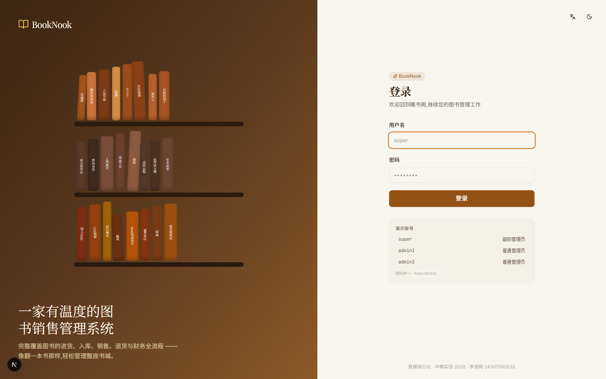
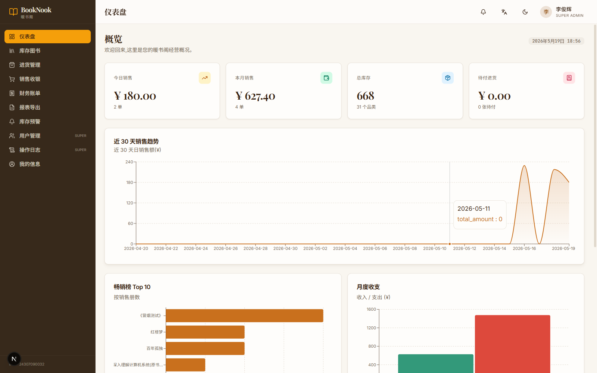
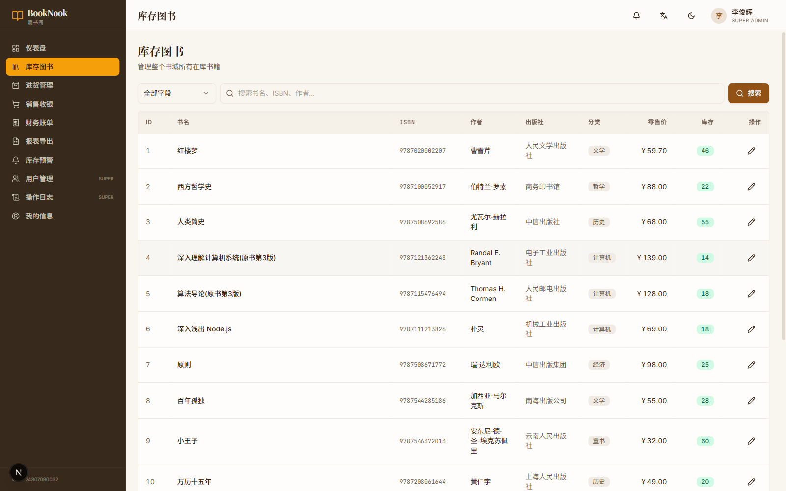
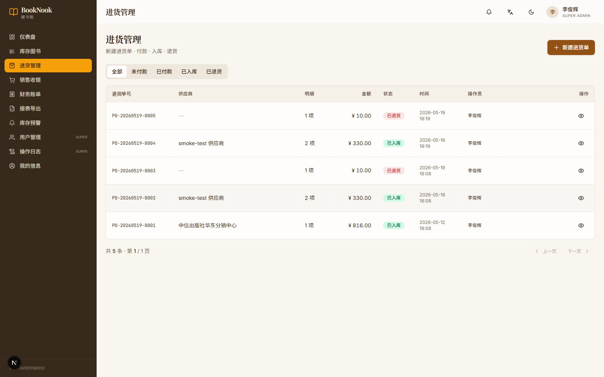
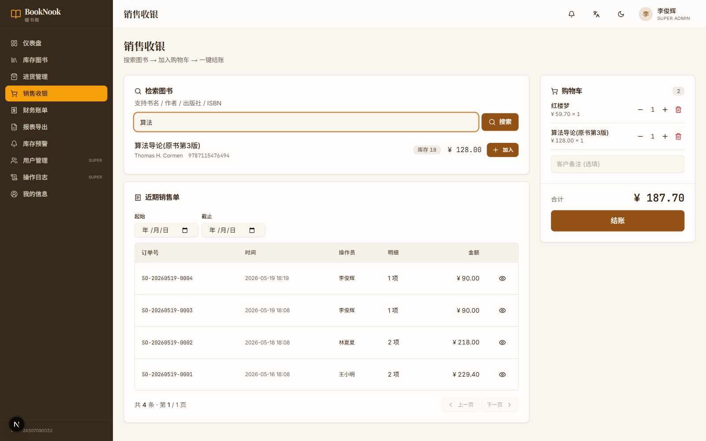
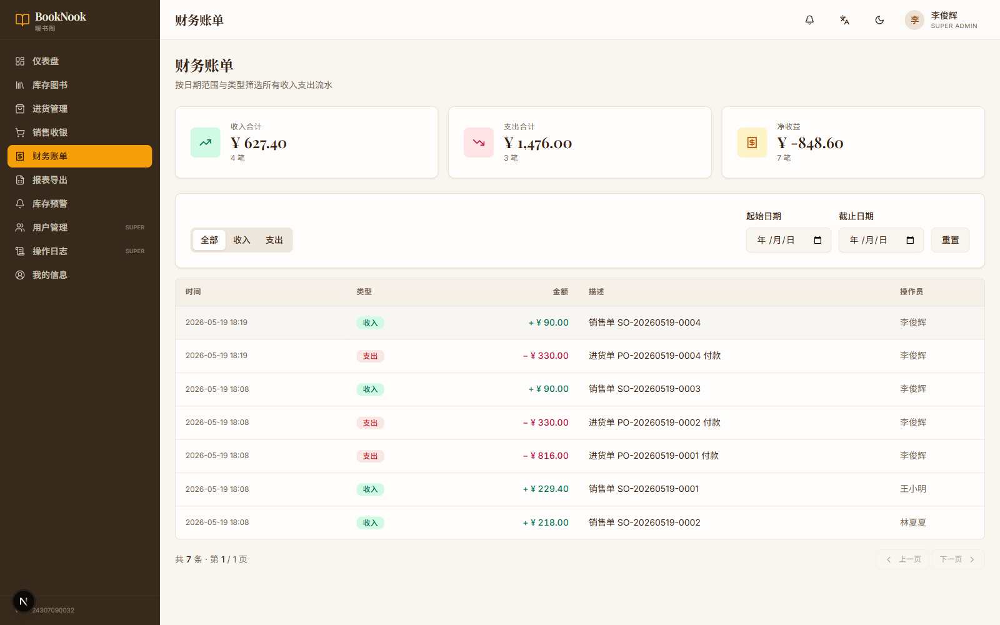
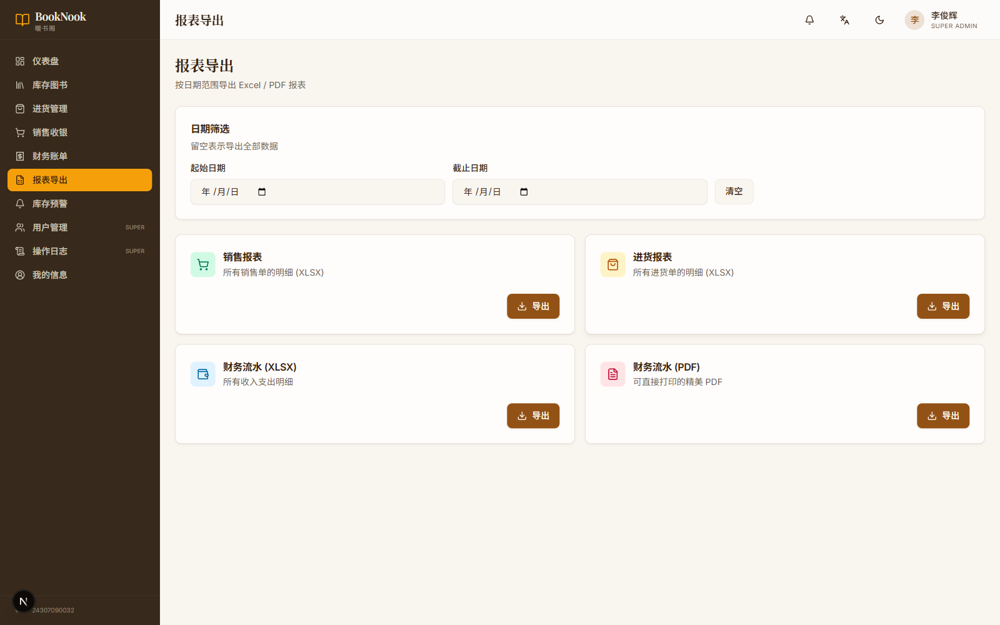
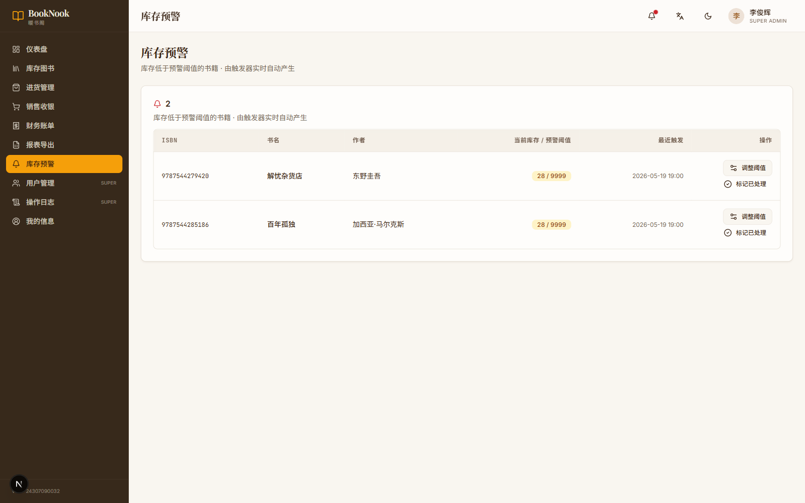
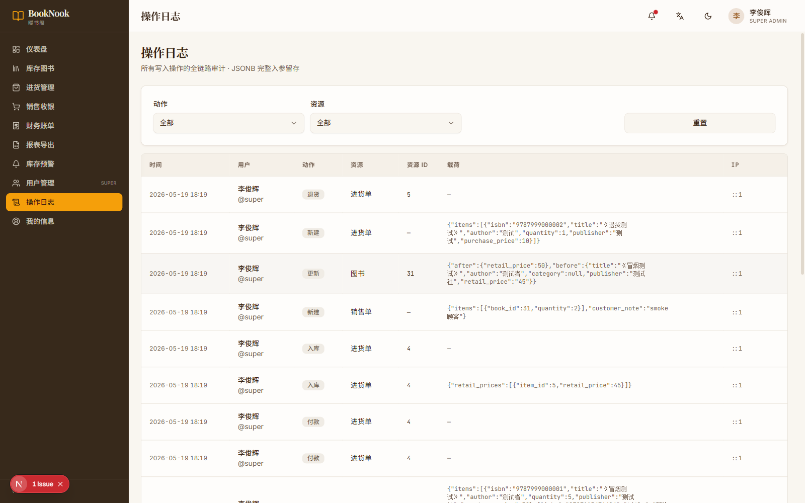
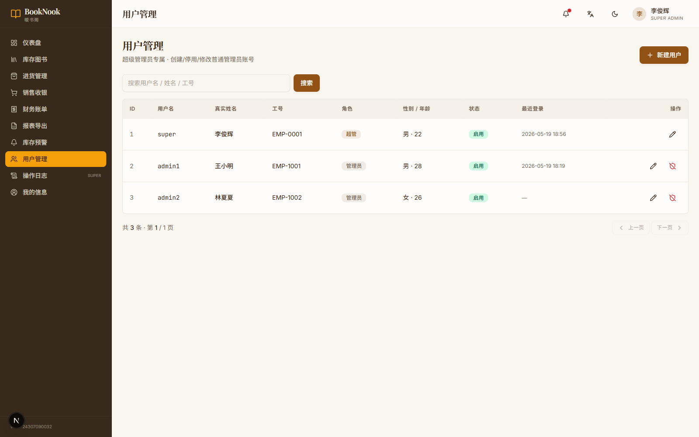

# 📚 BookNook · 暖书阁 · 图书销售管理系统

> **数据库引论 · 2026 中期实验**
> 一套覆盖图书进货、销售、财务全流程的精美书城管理系统。
> Node.js + Next.js + PostgreSQL 16 全栈实现。
>
> 作者: **李俊辉 24307090032**

---

## ✨ 项目亮点

| 维度 | 内容 |
|-----|------|
| 📊 **数据库** | 10 张表 / 6 个 Dashboard 视图 / 6 个触发器 / 6 个 PL/pgSQL 函数 / 满足 BCNF / 并发安全 |
| 🎨 **UI 设计** | 暖书店主题 · 米色+琥珀色 / Playfair Display + Noto Serif SC / 响应式 + 暗色模式 |
| ⚙️ **后端** | Express + TypeScript + Prisma + JWT(HS256+HttpOnly) + MD5+salt + RBAC + helmet + 操作审计(before/after) |
| 🌐 **前端** | Next.js 15 + React 19 + shadcn/ui + Recharts + 中英全覆盖 + 全局 ErrorBoundary |
| 📈 **加分项** | 数据可视化 / 库存预警 / 操作日志 / Excel+PDF 导出 / 暗色模式 / 国际化 / 全栈 TypeScript |
| 🛡 **稳健性** | gen_order_no advisory_xact_lock 并发安全 / 状态机非法跳变 RAISE / TOCTOU 修复 / 16 项冒烟测试全通过 |

## 🚀 一分钟启动

```powershell
# Step 1 · 初始化数据库
$env:PGPASSWORD = "你的密码"
.\scripts\00-init-db.ps1

# Step 2 · 后端 (新终端)
cd backend ; npm install ; npm run dev

# Step 3 · 前端 (再开一个终端)
cd frontend ; npm install ; npm run dev
```

打开 http://localhost:3000 → 演示账号 `super / Admin@2026`

> 🐣 **从零开始装环境?** 看 [`docs/新手上手指南.md`](./docs/新手上手指南.md) — 装 Node/PG/Python 全程手把手, 90 分钟跑起来。
>
> 📖 **现场演示?** 看 [`操作手册.md`](./操作手册.md) — 10 分钟演示流程 + 答辩 FAQ。

## 📂 目录结构

```
booknook/
├── README.md                ← 你正在看
├── 操作手册.md              ← 现场演示流程 / 助教 FAQ / 答辩准备
│
├── database/                ← PostgreSQL 脚本
│   ├── 01-schema.sql        ← 10 张表 + 6 触发器 + 6 函数
│   ├── 02-seed.sql          ← 3 用户 + 30 本书种子数据
│   ├── 03-views.sql         ← 6 个 Dashboard 视图
│   └── 99-drop-all.sql      ← 重置脚本
│
├── backend/                 ← Express + TypeScript + Prisma
│   ├── prisma/schema.prisma ← Prisma 模型 (与 SQL 双向校对)
│   ├── src/
│   │   ├── config/          ← env / db / logger
│   │   ├── middlewares/     ← auth / rbac / audit / validate / error
│   │   ├── modules/         ← 10 个业务模块 (auth/users/books/...)
│   │   ├── utils/           ← md5 / jwt / http
│   │   └── server.ts
│   └── .env.example
│
├── frontend/                ← Next.js 15 (App Router) + shadcn/ui
│   ├── src/
│   │   ├── app/             ← 路由 (login + (app)/<10 个业务页>)
│   │   ├── components/      ← UI / layout / charts
│   │   ├── i18n/            ← 中英双语字典 (10 模块全覆盖)
│   │   ├── lib/             ← api 客户端 / utils
│   │   └── stores/          ← zustand auth store
│   └── tailwind.config.ts
│
├── docs/                    ← 报告与文档
│   ├── 新手上手指南.md      ← 🐣 从零装环境到跑起来 (新手必读)
│   ├── 操作手册.md          → 见顶层
│   ├── 验证指南.md          ← 🧪 端到端验证清单 + v1.1 改动复核
│   ├── 项目讲解手册.md      ← 📖 1100 行代码导览 (给"想看懂"的人)
│   ├── 实验报告.md          ← 提交版完整报告
│   ├── 数据库设计.md        ← ER 图 + 范式分析 + 触发器
│   ├── API文档.md           ← 全部 REST 接口
│   ├── 创新点说明.md        ← 加分项专项
│   └── images/              ← 10 张演示截图
│
└── scripts/                 ← PowerShell + Python 工具
    ├── 00-init-db.ps1       ← 一键建库 + seed
    ├── 01-reset-db.ps1      ← 重置数据库
    ├── 10-start-backend.ps1 ← 启动后端 (可选)
    ├── 11-start-frontend.ps1← 启动前端 (可选)
    ├── 99-package-submission.ps1 ← 打包提交 zip
    └── smoke-test.py        ← 16 项端到端冒烟测试
```

## 🖼 截图预览

| 登录页 (棕色书架风) | Dashboard (4 KPI + 4 图表) |
|--|--|
|         |   |

| 库存图书 (30 本预置 + 5 字段查询) | 进货管理 (四态机) |
|--|--|
|         |     |

| 销售收银 (购物车 + 结账) | 财务账单 (收入/支出筛选) |
|--|--|
|         |  |

| 报表导出 (XLSX + PDF) | 库存预警 (触发器自动产生) |
|--|--|
|       |        |

| 操作日志 (JSONB + before/after) | 用户管理 (RBAC · 仅超管) |
|--|--|
|          |         |

## 📚 关键文档

按阅读顺序排:

| 文档 | 写给谁 | 一句话简介 |
|---|---|---|
| 🐣 [`docs/新手上手指南.md`](./docs/新手上手指南.md) | 完全没碰过项目的人 | 从装 Node.js 开始, 手把手 90 分钟跑起来 |
| 📖 [`docs/项目讲解手册.md`](./docs/项目讲解手册.md) | 想看懂代码的人 | 1100 行白话代码导览 + 答辩前自测 |
| 🧪 [`docs/验证指南.md`](./docs/验证指南.md) | 答辩前自检 | 16 项 smoke-test + v1.1 加固复核 |
| 🎬 [`操作手册.md`](./操作手册.md) | 现场演示用 | 10 分钟演示流程 + 助教 FAQ |
| 📋 [`docs/实验报告.md`](./docs/实验报告.md) | 提交评分 | 完整实验报告 (BCNF / 触发器 / 安全 / 测试) |
| 🗄 [`docs/数据库设计.md`](./docs/数据库设计.md) | DB 部分专项 | ER 图 + 范式分析 + 触发器 + 索引 |
| 🌐 [`docs/API文档.md`](./docs/API文档.md) | 调用 API 用 | 全部 REST 接口 + 错误码 + cURL 速查 |
| ✨ [`docs/创新点说明.md`](./docs/创新点说明.md) | 加分项答辩 | 13 个加分项详细技术亮点 |

## 🛠 技术栈

**后端**
- Node.js 24 · Express · TypeScript · Prisma ORM
- PostgreSQL 16 · pg_trgm · pgcrypto
- JWT · Zod · Pino · ExcelJS · PDFKit

**前端**
- Next.js 15 (App Router) · React 19 · TypeScript
- Tailwind CSS · shadcn/ui · Radix Primitives · Lucide Icons
- Recharts · zustand · next-themes · Sonner

## 🔧 质量改进与稳健性 (v1.1)

> 第二轮深度审查后追加的工程改进。完整列表见 [`操作手册.md §12`](./操作手册.md#-12-质量改进列表)。

**数据库层**
- `gen_order_no` 用 `pg_advisory_xact_lock` 串行化生成,杜绝并发取号冲突
- 进货状态机三个合法分支外的转移会 `RAISE EXCEPTION`,防止 psql 直连绕过
- 销售流水改用 statement-level 触发器,`amount = SUM(items.subtotal)` 由 DB 保证一致
- 入库时 ISBN 命中老书会比对 title/author/publisher,不一致即拒绝
- `inventory_alerts` 加部分唯一索引,杜绝并发产生双条
- `v_daily_sales_trend` 改写,避免 JOIN items 后重复求和 (修了一个会让 Dashboard 数据虚高的 bug)

**后端层**
- JWT 算法显式锁定 `HS256` / 拒绝弱口令默认值 / is_active 实时校验 (30s LRU)
- `helmet` + `express-rate-limit` (登录 20/15m) + body limit 256kb
- 移除响应 body 中的 token,鉴权只走 HttpOnly Cookie (SameSite=strict + path=/api)
- 错误处理映射 Prisma `P2002 → 409` / `P2003 → 400` / `SyntaxError → 400` / 生产环境兜底脱敏
- 操作日志深度脱敏 + 路由信息提前缓存 + 价格变更 before/after 留痕

**前端层**
- `RoleGuard` 包用户/日志页面,普通管理员手输路径自动 replace
- 库存徽章三元运算修正,缺货红徽章正确显示
- `toCnRangeIso` 统一日期范围处理,解决跨日时区漂移
- 全业务页 i18n 覆盖,EN 模式无残留中文 (PageHeader / 列头 / 主按钮)
- 全局 `error.tsx` ErrorBoundary,任何渲染错误显示友好页

**验证**
- `tsc --noEmit` (前后端) 干净通过
- `next build` 成功
- `python scripts/smoke-test.py` 16/16 通过

## 📜 许可

仅供数据库引论实验提交使用,代码风格鼓励 fork 学习。

---

🌿 **Made with care for 数据库引论 2026.**
