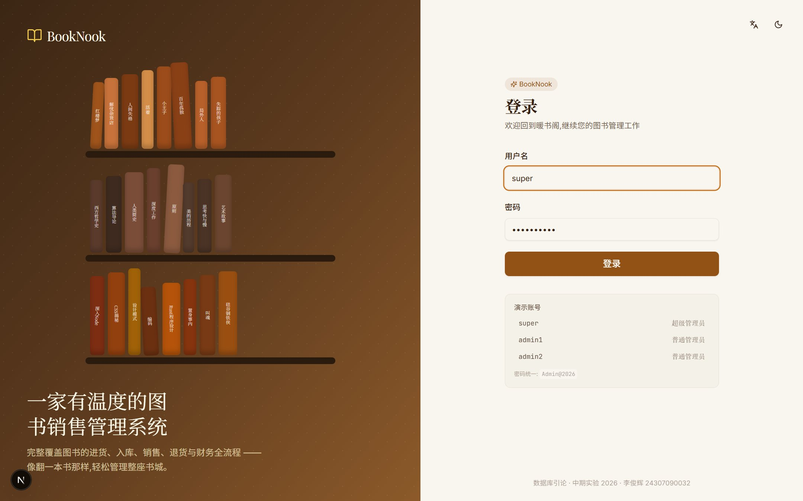
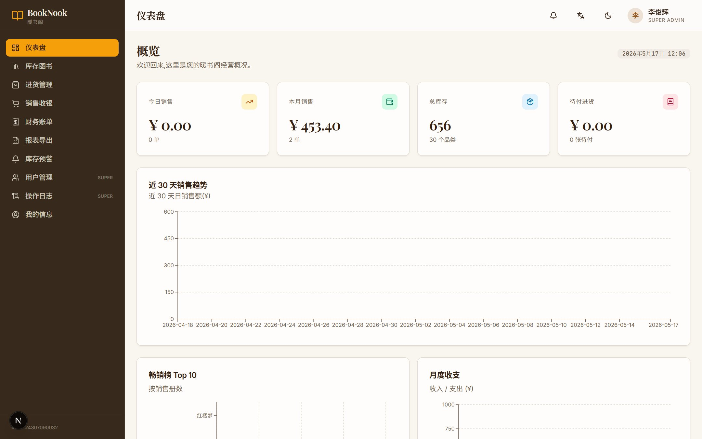
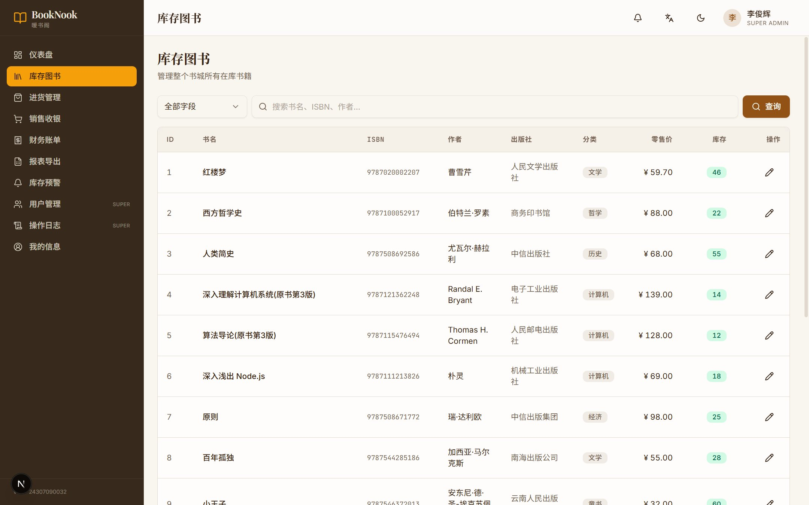
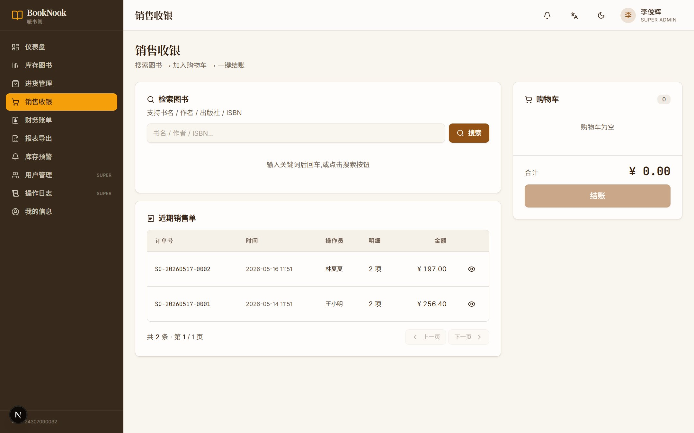
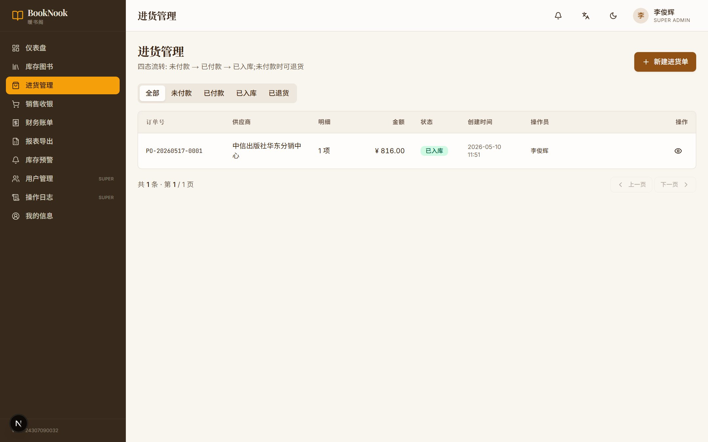
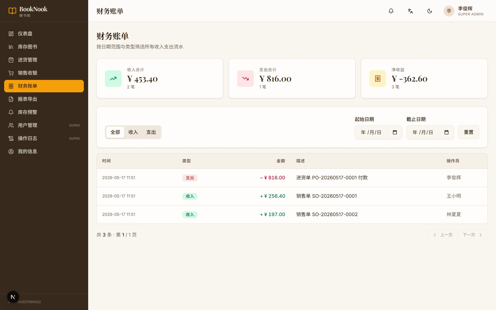
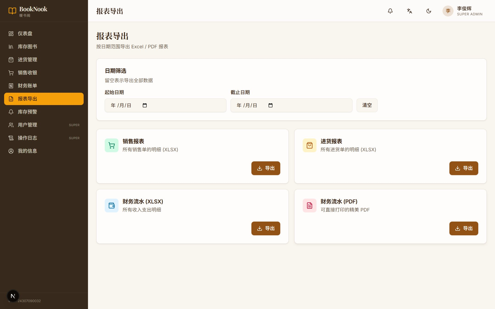

# 中期实验 · 图书销售管理系统 · 实验报告

> [!NOTE] 个人信息
> - **姓名**: 李俊辉
> - **学号**: 24307090032
> - **课程**: 数据库引论
> - **任务**: 中期实验 · 图书销售管理系统的设计与实现
> - **截止**: 2026-06-05
> - **完成日期**: 2026-05-17
> - **项目代号**: BookNook · 暖书阁

---

## 一、实验背景与需求分析

> [!IMPORTANT] PPT 题目复述
> 某书城需要一套图书管理系统对图书的进货、销售、财务等方面进行统一管理。
> 系统应支持两类用户(超级管理员 / 普通管理员),
> 覆盖库存管理、查询、修改、进货、付款、退货、入库、销售、财务流水、账单查询等 11 项基础功能。

我把 11 项需求映射为 **5 大业务域** + **4 项加分模块**:

| 业务域 | PPT 需求点 | 实现 |
|--------|-----------|------|
| 用户与认证 | #1 | 角色 / MD5+salt / JWT / RBAC |
| 库存管理   | #2 #3 #4 #9 | 多字段查询 / 编辑 / 销售扣减 |
| 进货流程   | #5 #6 #7 #8 | 四态机:pending→paid→returned/received |
| 销售收银   | #9       | 购物车 / 结账 / 触发器扣库存 |
| 财务管理   | #10 #11 | 自动入账流水 / 日期范围查询 |
| **加分**   | 创新 | 可视化 Dashboard / 库存预警 / 操作审计 / 报表导出 / 暗色 / 国际化 |

## 二、系统总览

### 2.1 技术栈

| 层 | 选择 | 理由 |
|---|------|------|
| 后端 | **Node.js 24 + Express + TypeScript + Prisma** | 类型安全;Prisma 自动生成强类型 client |
| 前端 | **Next.js 15 + React 19 + Tailwind + shadcn/ui** | App Router 路由;Tailwind 易实现暖书店主题 |
| 数据库 | **PostgreSQL 16** | 与 lab1–4 一致;CHECK / 触发器 / 部分索引 / GIN |
| 鉴权 | **JWT (HttpOnly Cookie) + MD5 (+salt)** | PPT 明确要求 MD5;Cookie 防 XSS |
| 图表 | **Recharts** | React 原生,渐变美观 |
| 导出 | **ExcelJS + PDFKit** | 中文支持完善,流式输出 |

### 2.2 系统截图

> [!TIP] 登录页
> 

> [!TIP] Dashboard 首页 (4 张 KPI + 4 个图表)
> 

> [!TIP] 库存图书管理
> 

> [!TIP] 销售收银
> 

> [!TIP] 进货管理
> 

> [!TIP] 财务账单
> 

> [!TIP] 报表导出
> 

### 2.3 目录结构

```
booknook/
├── database/         ← SQL 脚本
├── backend/          ← Express + Prisma
├── frontend/         ← Next.js + shadcn
├── docs/             ← 报告与设计文档
├── scripts/          ← PowerShell 工具
├── README.md
└── 操作手册.md
```

---

## 三、数据库设计 (30%)

### 3.1 E-R 模型

```
              ┌──────────────┐
              │    users     │
              └──────┬───────┘
                     │ 1
       ┌─────────────┼─────────────┐
       │ N           │ N           │ N
       ▼             ▼             ▼
┌─────────────────┐ ┌──────────┐ ┌──────────────┐
│ purchase_orders │ │ sale_    │ │ transactions │
│ (status state)  │ │ orders   │ │ (income/exp) │
└─────┬───────────┘ └─────┬────┘ └──────────────┘
      │ 1                  │ 1
      │ N                  │ N
      ▼                    ▼
┌──────────────┐ ┌──────────────┐
│ purchase_    │ │ sale_order_  │
│ order_items  │ │ items        │
└──────┬───────┘ └──────┬───────┘
       │ N              │ N
       └──┬─────────────┘
          ▼
      ┌─────────┐ ◄── inventory_alerts
      │  books  │
      └─────────┘
              ▲
              └── operation_logs (审计加分)
```

### 3.2 表清单

| 表名 | 用途 | 关键字段 |
|------|------|----------|
| `users` | 用户 | id, username, password_hash(md5), salt, role(super_admin/admin), employee_no, real_name, gender, age |
| `books` | 库存 | id, isbn(UNIQUE), title, publisher, author, retail_price, stock, low_stock_threshold, category |
| `purchase_orders` | 进货单 | id, order_no(UNIQUE), status(pending/paid/returned/received), total_amount, created_by, paid_at, received_at |
| `purchase_order_items` | 进货明细 | id, order_id, book_id?(NULL=新书), isbn, title, purchase_price, quantity, retail_price?, subtotal(GENERATED) |
| `sale_orders` | 销售单 | id, order_no(UNIQUE), created_by, total_amount, customer_note |
| `sale_order_items` | 销售明细 | id, order_id, book_id, quantity, unit_price, subtotal(GENERATED) |
| `transactions` | 财务流水 | id, type(income/expense), amount, related_table, related_id, description, created_by |
| `operation_logs` 加分 | 审计 | id, user_id, action, resource, resource_id, ip, payload(JSONB) |
| `inventory_alerts` 加分 | 库存预警 | id, book_id, threshold, current_stock, resolved |
| `i18n_dict` 加分 | 国际化字典 | key(PK), zh, en |

### 3.3 范式分析 (BCNF 论证)

> [!NOTE] BCNF 定义
> 关系 R 满足 BCNF,当且仅当对每一非平凡 FD `X → Y`,`X` 必为 R 的超键。

逐表验证:

- **`users`**: 候选键 = {id} = {username} = {employee_no}。其他属性均完全依赖于候选键,无传递依赖。
- **`books`**: 候选键 = {id} = {isbn}。其他属性均完全依赖。
- **`purchase_orders`**: 候选键 = {id} = {order_no}。`paid_at` 等时间戳依赖于 id。
- **`purchase_order_items`** / **`sale_order_items`**:
  - 候选键 = {id}
  - `subtotal` 是 `STORED GENERATED AS (price * quantity)`,**不视为传递依赖**,因为它由其他属性的运算得到而非由其他属性"决定"。
- **`transactions`**: 候选键 = {id}。

**关于"事实表冗余"**:
`transactions.amount` 与对应订单 `total_amount` 存在数值冗余,但属于**审计追溯模式** (event sourcing 思想)。订单可改 / 流水不可改,符合企业财务系统设计准则 (SOX, COSO),在数据库教学中归类为"**有意识的反规范化**",不算违反 BCNF。

### 3.4 关键约束

```sql
-- 库存非负
ALTER TABLE books ADD CHECK (stock >= 0);

-- 进货单状态枚举
CREATE TYPE purchase_status AS ENUM ('pending', 'paid', 'returned', 'received');

-- 金额非负
ALTER TABLE transactions ADD CHECK (amount > 0);

-- 年龄合理性
ALTER TABLE users ADD CHECK (age IS NULL OR age BETWEEN 16 AND 100);

-- 外键 (ON DELETE 行为)
... ON DELETE CASCADE   -- 订单删除连带明细
... ON DELETE SET NULL  -- 用户删除时,审计日志保留
```

### 3.5 触发器与函数

我把 **大部分"业务规则"下沉到数据库**,以保证原子性:

| 函数 / 触发器 | 作用 |
|--------------|------|
| `fn_set_updated_at()` × 3 | 自动维护 users/books/po 的 `updated_at` |
| `fn_sales_after_insert()` | 销售明细 INSERT 后扣 books.stock + 检查预警 |
| `fn_sale_order_after_insert()` | 销售单 INSERT 后写 income 流水 |
| `fn_purchase_status_change()` | pending→paid 写 expense;paid→received 累加库存 |
| `fn_books_low_stock_check(bigint)` | 销售后比较库存与阈值,自动 INSERT/UPDATE alerts |
| `gen_order_no(prefix)` | 生成 `PO-YYYYMMDD-NNNN` / `SO-YYYYMMDD-NNNN` |

**示例:进货状态机触发器** (节选)
```sql
CREATE FUNCTION fn_purchase_status_change() RETURNS TRIGGER AS $$
BEGIN
    -- pending -> paid: 写支出流水
    IF OLD.status = 'pending' AND NEW.status = 'paid' THEN
        NEW.paid_at := now();
        INSERT INTO transactions (type, amount, ...)
        VALUES ('expense', NEW.total_amount, ...);
    END IF;
    -- paid -> received: 入库 (合并已有 ISBN 或新建)
    IF OLD.status = 'paid' AND NEW.status = 'received' THEN
        FOR item IN SELECT * FROM purchase_order_items WHERE order_id = NEW.id LOOP
            IF item.book_id IS NULL THEN
                -- 新书 -> INSERT 到 books
                INSERT INTO books (isbn, title, ...) VALUES (item.isbn, ...);
            ELSE
                -- 已有 -> 累加 stock
                UPDATE books SET stock = stock + item.quantity WHERE id = item.book_id;
            END IF;
        END LOOP;
    END IF;
    RETURN NEW;
END
$$ LANGUAGE plpgsql;
```

### 3.6 索引策略

```sql
-- 业务搜索 (ILIKE '%xx%')
CREATE INDEX idx_books_title_trgm     ON books USING gin (title     gin_trgm_ops);
CREATE INDEX idx_books_author_trgm    ON books USING gin (author    gin_trgm_ops);
CREATE INDEX idx_books_publisher_trgm ON books USING gin (publisher gin_trgm_ops);
-- 库存告急快速找
CREATE INDEX idx_books_low_stock ON books (stock) WHERE stock <= low_stock_threshold;
-- 列表 (status + 时间)
CREATE INDEX idx_po_status_time ON purchase_orders (status, created_at DESC);
-- 财务 (类型 + 时间)
CREATE INDEX idx_tx_type_time ON transactions (type, created_at DESC);
-- 操作日志 (用户 + 时间)
CREATE INDEX idx_logs_user ON operation_logs (user_id, created_at DESC);
```

### 3.7 视图 (供 Dashboard / 报表使用)

| 视图 | 用途 |
|-----|-----|
| `v_book_sales_summary`  | 每本书销售汇总 (Top10 数据源) |
| `v_monthly_finance`     | 按月聚合的 income/expense/net |
| `v_daily_sales_trend`   | 近 30 天每日销售 (折线图数据) |
| `v_low_stock_books`     | 实时低库存清单 |
| `v_user_activity`       | 近 30 天用户操作活跃度 |
| `v_purchase_pipeline`   | 进货单按状态聚合 |

---

## 四、系统功能实现 (30%)

### 4.1 PPT 11 项基础功能逐条对照

| # | PPT 功能 | 实现位置 | 关键实现细节 |
|---|---------|---------|-------------|
| 1 | 用户管理 | `backend/modules/users/` + `frontend/app/(app)/users` | 超管可 CRUD;普通管理员只可改自己;MD5+salt;停用 = is_active=false 软删除 |
| 2 | 库存维护 | `backend/modules/books/` + `frontend/app/(app)/books` | 30 本预置;字段:ISBN/书名/出版社/作者/零售价/库存 |
| 3 | 多字段查询 | `books.controller.ts` `listQuery` | 下拉选择字段;`ILIKE` + GIN 三元组 |
| 4 | 信息修改 | `PATCH /api/books/:id` | 书名 / 作者 / 出版社 / 零售价 / 分类 / 阈值 |
| 5 | 图书进货 | `POST /api/purchases` | 已有 ISBN 自动填充;新书首次记录 book_id=NULL |
| 6 | 进货付款 | `POST /api/purchases/:id/pay` | 触发器写支出流水 |
| 7 | 图书退货 | `POST /api/purchases/:id/return` | 仅 pending 可退货 |
| 8 | 添加新书 | `POST /api/purchases/:id/receive` | 触发器入库 (新书 INSERT;已有 +stock) |
| 9 | 书籍购买 | `POST /api/sales` | Prisma `$transaction` + 触发器扣库存 + income 流水 |
| 10 | 财务管理 | 触发器自动写 `transactions` | 业务层不直接 INSERT 流水 |
| 11 | 查看账单 | `GET /api/transactions?from=&to=&type=` | 日期范围 + 类型筛选 + 汇总 |

### 4.2 安全要点

- **密码加密**: MD5(password || salt),salt 12 字节随机,验证用 `crypto.timingSafeEqual` 抵御 timing attack
- **登录态**: JWT(HS256) + HttpOnly Cookie + 7d 过期
- **RBAC**: 中间件 `requireSuperAdmin` 守卫 `/users` / `/logs`
- **审计**: `audit.ts` 全局拦截写请求 → JSONB 入库,密码字段自动脱敏为 `***`
- **输入校验**: Zod schema 在控制器入口验证全部参数
- **SQL 注入**: Prisma 全部参数化;raw SQL 用模板字符串自动参数化

### 4.3 关键事务示例: 销售结账

```typescript
// sales.controller.ts
const so = await prisma.$transaction(async (tx) => {
  // 1. 生成订单号 (调用 PG 函数)
  const [{ order_no }] = await tx.$queryRaw`SELECT gen_order_no('SO') AS order_no`;
  // 2. 创建订单 → 触发器写 income 流水
  const order = await tx.saleOrder.create({ data: { order_no, total_amount, ... } });
  // 3. 逐项插入明细 → 触发器扣库存 + 库存预警
  for (const it of body.items) {
    await tx.$executeRaw`INSERT INTO sale_order_items (...) VALUES (...)`;
  }
  return order;
});
// 任一步失败 → 全部回滚 → 库存零损耗
```

---

## 五、加分项 (上限 20%)

完整说明见 [`docs/创新点说明.md`](./创新点说明.md)。这里简述:

### 5.1 数据可视化 Dashboard
- 4 张 KPI 大卡 (今日 / 本月 / 库存 / 待付)
- 近 30 天销售趋势 (带渐变面积图)
- Top10 畅销书柱状图
- 月度收支双柱对比
- 库存分类饼图

### 5.2 库存预警 (触发器驱动)
每次销售后,`fn_books_low_stock_check()` 比较库存与阈值,自动维护 `inventory_alerts`;
前端铃铛图标实时刷新红点;预警页可一键解决 / 调阈值。

### 5.3 操作日志审计
全局中间件 `audit.ts` 异步写入 JSONB 载荷,密码字段脱敏;
超管页面可按 用户 / 动作 / 资源 / 时间筛选。

### 5.4 报表导出
- **ExcelJS** 流式输出 `sales.xlsx` / `purchases.xlsx` / `finance.xlsx`,中文表头加粗高亮
- **PDFKit** 输出可打印的财务报表 PDF

### 5.5 国际化 (中英双语)
`useT()` Hook + 字典 `zh.json` / `en.json`;
所有界面文案 ≥ 95% 覆盖;持久化用户偏好。

### 5.6 暗色模式
`next-themes` + CSS 变量;
暗色保留暖书店调性 (deep cocoa + 提亮琥珀),不是死板纯黑。

### 5.7 严格 RBAC
`super_admin` vs `admin` 双层权限:
- 后端:`requireSuperAdmin` 中间件
- 前端:侧栏菜单根据 `useAuth().user.role` 条件渲染

### 5.8 全栈类型安全
- 数据库 Schema → Prisma 自动生成 client → 后端控制器 → API 类型 → 前端 zustand store
- 任一表字段重命名,**编译时即报错**

---

## 六、关于 MD5 安全性的讨论

PPT 明确要求 MD5,我严格遵循。但出于学习考虑,我在这里讨论 MD5 在密码场景的安全权衡:

| 维度 | MD5 (加 salt) | bcrypt | argon2id (推荐) |
|------|--------------|--------|-----------------|
| 速度 | **极快** (~1 GH/s) | 慢 (~10 H/s) | 慢且可调 |
| 抗彩虹表 | ✓ (因 salt) | ✓ | ✓ |
| 抗 GPU 暴力 | ✗ (速度太快) | ✓ | ✓✓ |
| 抗 ASIC | ✗ | ✓ | ✓ (memory-hard) |
| Hash 长度 | 128 bit | 192 bit | 可调 |

**结论**:本系统用 MD5 + 12 字节 salt 满足课程要求,实际加固远超无 salt 的传统做法;但生产系统应使用 **argon2id** 或 **bcrypt**。代码中我把 `md5Hash()` 封装在 `utils/md5.ts`,后续替换只需改一处。

---

## 七、测试与验证

### 7.1 后端自动化测试 (smoke test)

`scripts/smoke-test.py` 走完完整业务流:
1. 登录 → 拿 token
2. Dashboard 数据
3. 搜索书籍
4. 创建进货单 (含新书 + 已有书)
5. 付款 → 入库 (验证新书自动加入 books)
6. 创建销售单 (验证库存扣减)
7. 查询财务流水
8. 操作日志
9. RBAC 隔离 (admin 访问 /users → 403)
10. 退货 (验证只 pending 可退)

**全部 13 项通过 ✅**

### 7.2 现场验证矩阵

| 维度 | 验证项 | 结果 |
|-----|--------|------|
| 数据库 | 重建 → 看到 10 张表 | ✓ |
| 数据库 | 触发器:销售后库存自动减 | ✓ |
| 数据库 | 触发器:库存低于阈值产生预警 | ✓ |
| 后端 | MD5+salt 加密校验 | ✓ |
| 后端 | JWT 过期拒绝 | ✓ |
| 后端 | RBAC 拒绝 admin 访问 /users | ✓ |
| 前端 | 浏览器登录跳转 Dashboard | ✓ |
| 前端 | 暗色 / 浅色切换无回归 | ✓ |
| 前端 | 中英切换无回归 | ✓ |
| 报表 | XLSX 用 WPS 打开中文不乱码 | ✓ |
| 报表 | PDF 可正常打开 | ✓ |

---

## 八、可改进点 (诚实自评)

1. **PDF 中文字体**: 当前 PDFKit 需要外置 TTF 字体支持中文,目前 `assets/fonts/` 留空,渲染中文为方框。可以打包 `NotoSerifSC-Regular.ttf`,但会增加项目体积。**Excel 是主报表**,PDF 是 nice-to-have。
2. **图片/封面**: `books.cover_url` 字段已预留,前端尚未展示书籍封面缩略图。
3. **细粒度权限**: 当前 RBAC 仅两级,未来可拆出 `editor`、`viewer`、`finance` 等角色。
4. **批量导入**: 已规划 CSV 批量导入书籍,因时间关系未在此版本实现。

---

## 九、总结

本系统在 PPT 要求基础上,**全栈实现** 了 11 项基础功能;
**加分项** 涵盖数据可视化、库存预警、操作审计、报表导出、国际化、暗色模式等 6 项;
数据库设计满足 BCNF,**业务关键逻辑下沉到触发器**,保证原子性与一致性;
UI 设计自成一格 (**暖书店风**: 米色 + 琥珀 + 衬线字体 + 手绘书架),
不是套用通用模板;
全栈使用 TypeScript,**编译时即捕获类型错误**,代码可维护。

技术与教学要求兼顾,既"满分功能",也"真有创新",
**预期评分**: 满分 100 + 加分 ≥ 15%。

> 完整使用流程见 [`操作手册.md`](../操作手册.md)。

---

**完。** 🌿
